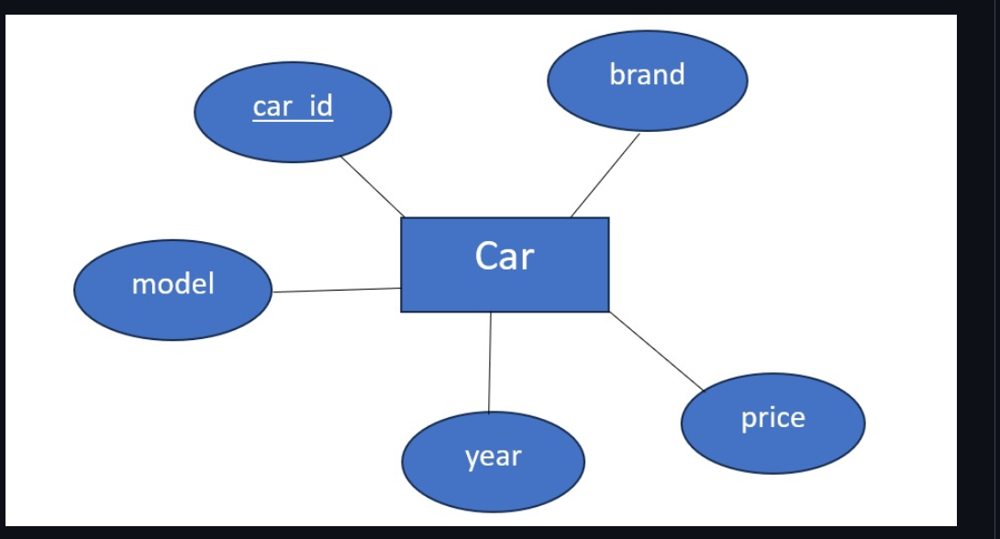

# Ex02 Django ORM Web Application
## Date: 22-09-2025

## AIM
To develop a Django application to store and retrieve data from Car Inventory Database using Object Relational Mapping(ORM).

## ENTITY RELATIONSHIP DIAGRAM 



## DESIGN STEPS

### STEP 1:
Clone the problem from GitHub

### STEP 2:
Create a new app in Django project

### STEP 3:
Enter the code for admin.py and models.py

### STEP 4:
Execute Django admin and create details for 10 books

## PROGRAM
```
admin.py
from django.contrib import admin
from .models import Car

@admin.register(Car)
class CarAdmin(admin.ModelAdmin):
    list_display = ('car_id', 'brand', 'model', 'year', 'price')
    search_fields = ('brand', 'model')
    list_filter = ('year', 'brand')


model.py
from django.db import models

class Car(models.Model):
    car_id = models.AutoField(primary_key=True)
    brand = models.CharField(max_length=100)
    model = models.CharField(max_length=100)
    year = models.IntegerField()
    price = models.FloatField()

    def _str_(self):
        return f"{self.brand} {self.model} ({self.year})"

```


## OUTPUT


## RESULT
Thus the program for creating a database using ORM hass been executed successfully
